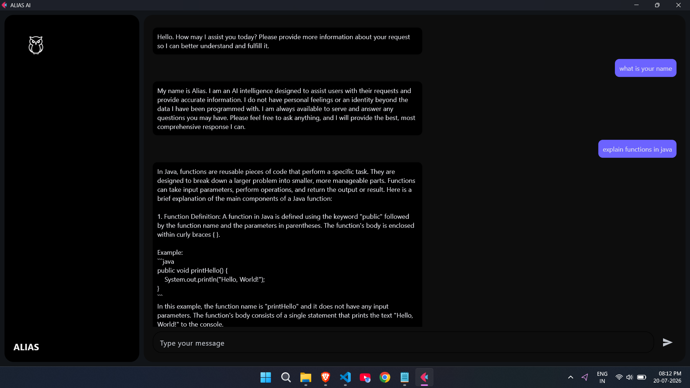

# <p align="center">Alias AI</p>

<p align="center">
Uncensored offline desktop AI assistant built with Python, Flet and Ollama.
</p>

<p align="center">
  
</p>

<h1 align="center">Alias AI</h1>

<p align="center">
An offline desktop AI assistant built with Python, Flet and Ollama.
</p>


<p align="center">


</p>


## About

Alias AI is an offline desktop AI assistant built using **Python**, **Flet**, and **Ollama**.

The application runs a locally hosted **Dolphin Phi 2.7B** language model, allowing conversations to stay on the user's machine without relying on cloud AI services.

The primary goal of this project was to learn how desktop applications can integrate local Large Language Models while maintaining complete user privacy.

---

## Features

- 🖥️ Desktop application built with Flet
- 🧠 Powered by Dolphin Phi 2.7B through Ollama
- 🔌 Completely offline after model installation
- 🔒 Conversations stay on your local machine
- 💬 Highly unrestricted responses (behavior depends on the selected local model)
- 🗑️ No chat history is stored
- ⚡ Lightweight and simple interface

---

## Tech Stack

- Python
- Flet
- Ollama
- [Dolphin Phi 2.7B](https://ollama.com/library/dolphin-phi:2.7b)

---
## 🧠 Model Selection

Alias AI uses **Dolphin Phi 2.7B** through **Ollama**.

I chose this model because I wanted the application to run smoothly on low-end systems while still providing good conversational quality. Another reason for choosing this model was its relatively unrestricted behavior compared to many other models, making it better suited for users who prefer fewer built-in response restrictions.

## 💻 Minimum System Requirements

The following requirements are for running the **Dolphin Phi 2.7B** model locally.

| Component | Minimum Requirement |
|-----------|---------------------|
| **RAM** | 4 GB (8 GB recommended) |
| **Storage** | 5 GB free disk space |
| **CPU** | Modern multi-core Intel, AMD, or Apple Silicon processor |
| **GPU** | Dedicated GPU not required |
| **Internet** | Required only to install Ollama and download the model |

## Installation

### Clone the repository

```bash
git clone https://github.com/aditya555-gif/Alias-AI.git
```

### Install dependencies

```bash
pip install -r requirements.txt
```

### Install Ollama

Download and install [Ollama](https://ollama.com/download/windows)

### Pull the model

```bash
ollama pull dolphin-phi:2.7b
```

### Run

```bash
python main.py
```

---

## 📷 Screenshots


---
To clear the chat history just click on the owl icon

## Current Limitations

- I have not added streaming responses yet
- RAG was planned but not implemented because I shifted my focus to Java backend development
- Supports one local model at a time

---

## Notes

- Chat history is intentionally **not saved**.
- Clearing the chat removes the conversation from the application interface.
- Model responses are generated entirely by the locally running LLM.

---

## Future Improvements

- PDF RAG
- Response streaming
- Multiple model support
- Better chat management
- Standalone executable

---


## 🤝 Contributing

Contributions, suggestions, and bug reports are always welcome.

If you have ideas for improving Alias AI or would like to implement features such as RAG, streaming responses, or UI enhancements, feel free to open an issue or submit a pull request.


---

## 📄 License

This project is shared for educational and portfolio purposes.
